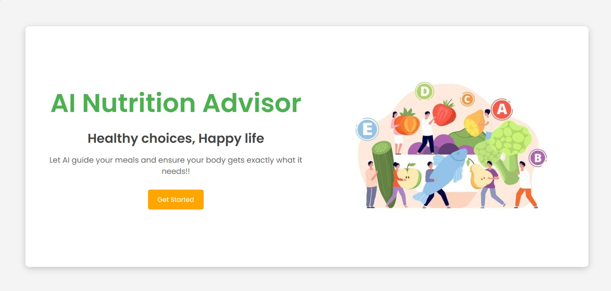
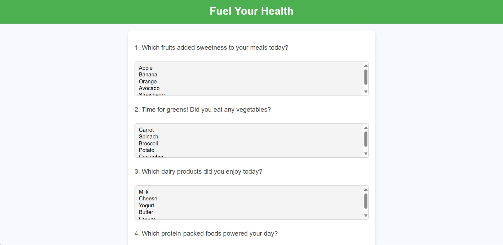
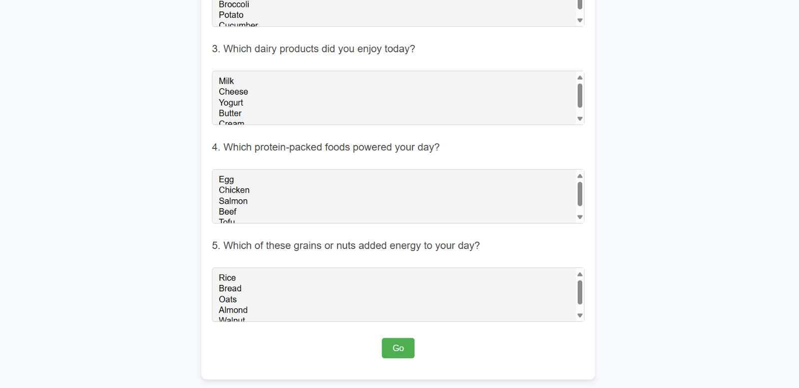
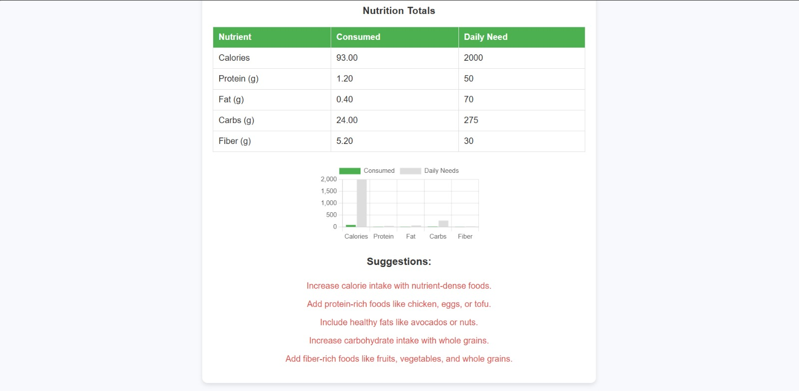
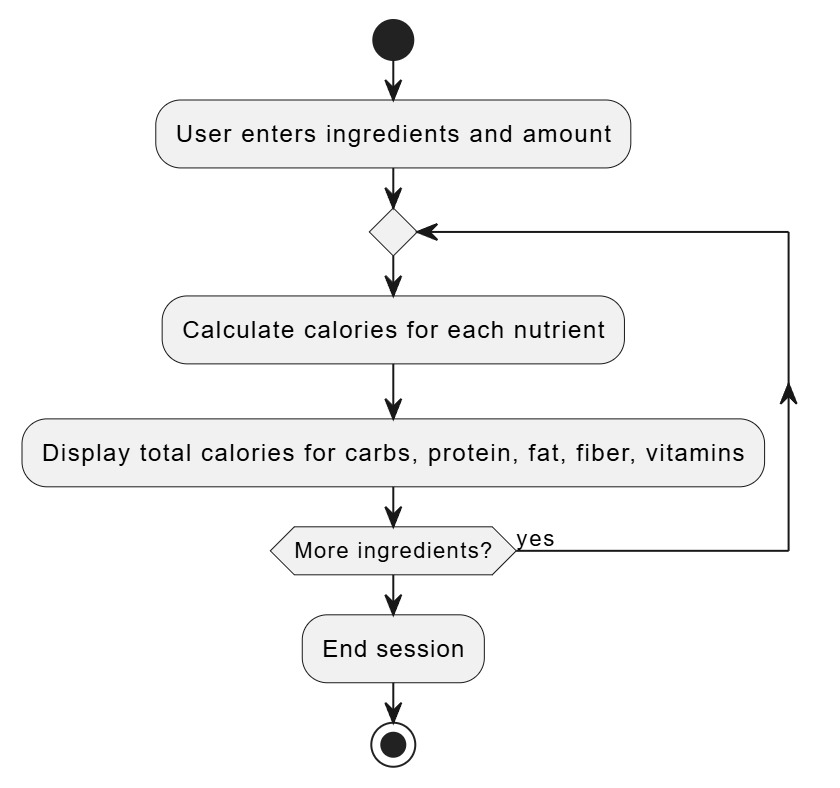
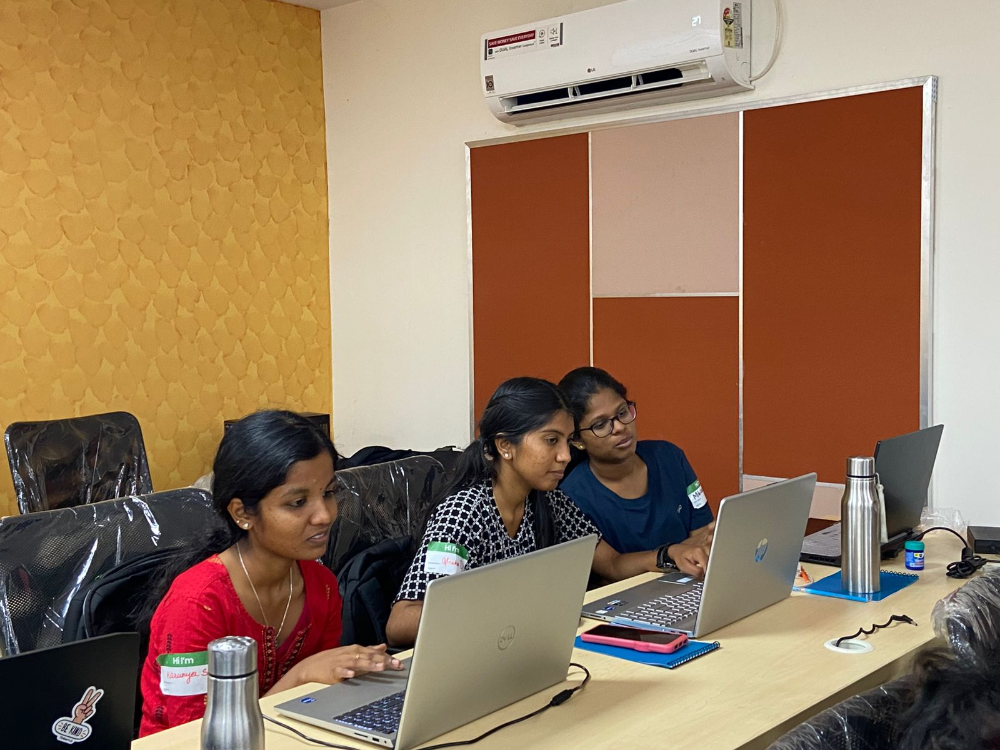

# BalanceBite
## Basic Details

###Team Name: **HackHerWay**

### Team Members
- Member 1:Sneha D - NSS College of Engineering, Palakkad
- Member 2:Karunya S - NSS College of Engineering, Palakkad
- Member 3:Mihikka S - NSS College of Engineering, Palakkad

### Hosted Project Link

### Project description
**BalanceBite** is a user-friendly website designed to help individuals analyze the nutritional content of their meals and maintain a balanced diet. By combining dietary data and workout details, the platform provides personalized recommendations for healthier living.

### The Problem Statement
Are you tired of wondering if your meals are as balanced as they seem? Tracking nutrients manually is tedious, and most apps just confuse you with data. The result? Unhealthy habits sneak in, and your health goals stay out of reach.

### The Solution
BalanceBite simplifies nutrition tracking by analyzing your meals and workouts to provide clear, personalized recommendations for a healthier diet.

## Technical Details
### Technologies/Components Used

**Language Used** : HTML,CSS,JavaScript
**Frameworks Used** :  
**Tools Used**:ChatGPT, Git, VSCode, App Script

### Implementation
## Installation
1. **Clone the repository:**
    ```bash
    git clone https://github.com/yourusername/BalanceBite.git
    cd BalanceBite
2. **Install dependencies:**
    ```bash
    npm install
3. **Start the development server:**
   ```bash
   npm start
## Run
1. **Development mode:**
   ```bash
   npm start
3. **Build for production:**
   ```bash
   npm run build

#### Project Documentation

## Screenshots






## Diagrams



## Build Photos



#### Project Demo

## Video
[Click here to watch the video](video/working.mp4)


## Additional Demos

### Team Contributions
* Sneha D: Led the web development, building and integrating the website's core features.
* Karunya S: Focused on designing the user interface to ensure a seamless and engaging user experience.
* Mihikka S: Responsible for analyzing the problem and creating flowcharts to guide the development process.
